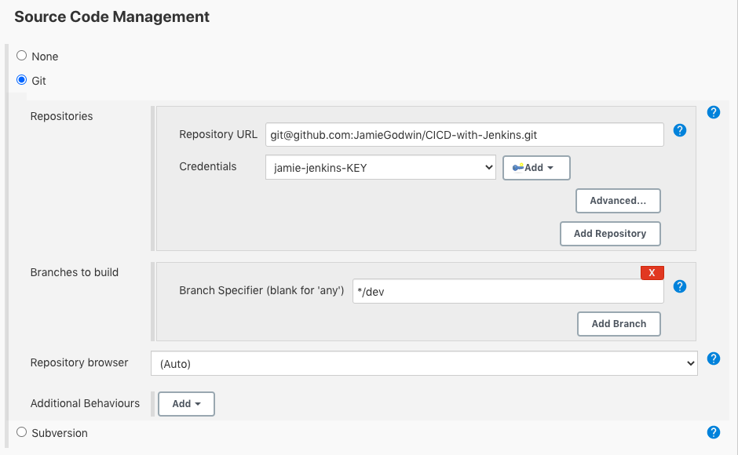
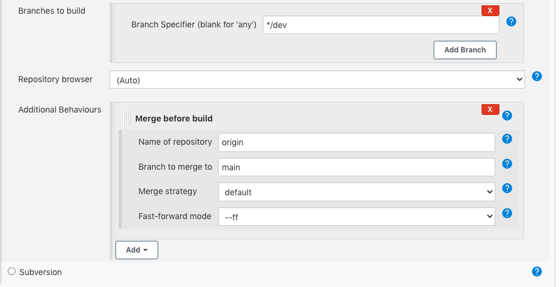
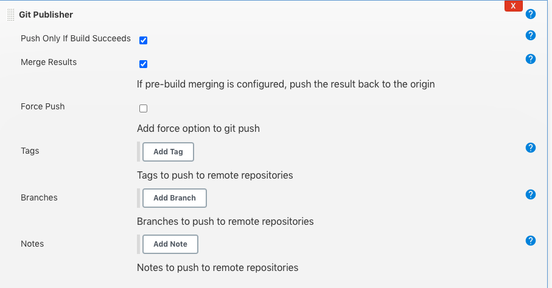
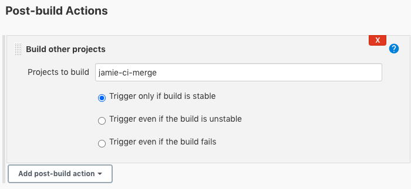
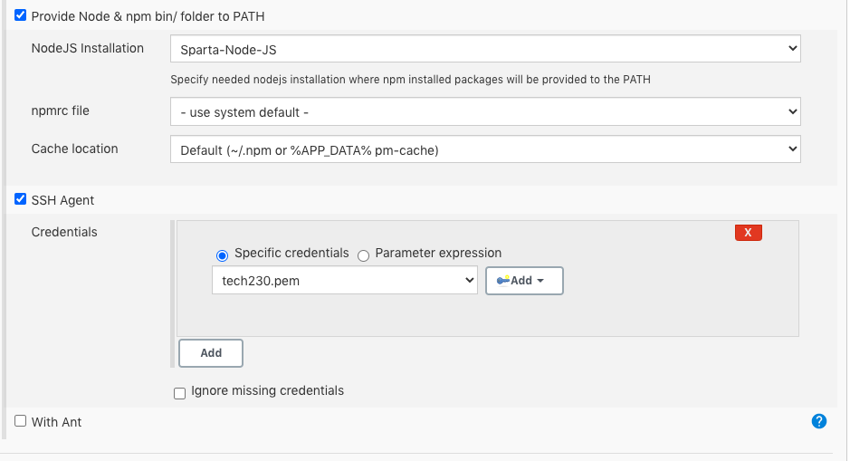
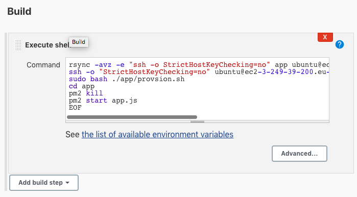
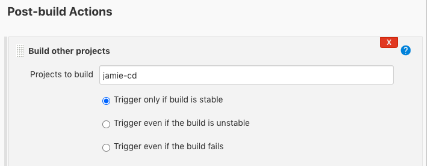

# Automating the CI/CD pipeline using Jenkins
- We will automate the pipeline by merging the changes to the dev branch in github to the main branch, which can then be tested and deployed on AWS.

## Continuous integration & delivery
- Within the repository that we're using, we need two branches, a `main` and a `dev`, which is used for development. 
- This can be done with the command `git checkout -b dev`

# Jenkins
- In Jenkins, we create a new job called "Jamie-ci" to fetch the GitHub repository with a webhook, where automated tests can be done. 
- The branch tracked needs to be the `dev` in order for everything here to be cloned. 

- We then need to merge the `main` with the `dev`. 
- We create a new job called "Jamie-ci-merge" 
- The configeration is the same, however we need to add the following:

- This allows us to merge the changes using the `main` branch in the `origin` repository that we used. 
- This time we don't want any build triggers to be included. 
- At the bottom in `Post-Build-Actions` we go to `Git Publisher`.
- In here we select the following options: 

- This means that we will push the merged changes back to GitHub. 
- If this works maually, we can then link it to our initial job, "Jamie-CI".
- We do this in the first job by doing: 

## Continuous Deployment
- In order to deploy, we need a new job, which I called "Jamie-cd".
- This will be used to deploy the `app` folder, that we have edited and merged, to production on our instance.
- We have previosuly merged our `dev` and `main` branch, and so in the source code management section we specify that the branch we build off is the `main`. 
- Under `Source-Code-Managment` we select the `branches-to-build` as the `main` this time.
- Note: This step isn't necessary as we have already merged the main branch, however it is good practice. 
-Under `Build Environment` we need to allow `SSH agent`, and allow our tech230.pem key. 

- In the `Build` step we now add an `Execute shell`. The copies the app from the Jenkins workspace into the EC2 instance
`rsync -avz -e "ssh -o StrictHostKeyChecking=no" app ubuntu@ec2-3-249-39-200.eu-west-1.compute.amazonaws.com:/home/ubuntu
ssh -o "StrictHostKeyChecking=no" ubuntu@ec2-3-249-39-200.eu-west-1.compute.amazonaws.com <<EOF
sudo bash ./app/provsion.sh
cd app
pm2 kill
pm2 start app.js
EOF`

- The IP address will need to be changed here to the public IP of the EC2 instance we have running. 
- If this works manually, we can put it in the pipeline in the "Jamie-ci-merge" by editing the `Post-Build-Action`:

- If we now push an edit to our `dev` branch, the pipeline should automatically work, and load the app.

- Note: Some errors can be encountered if the EC2 instance you initially launch has some issues.