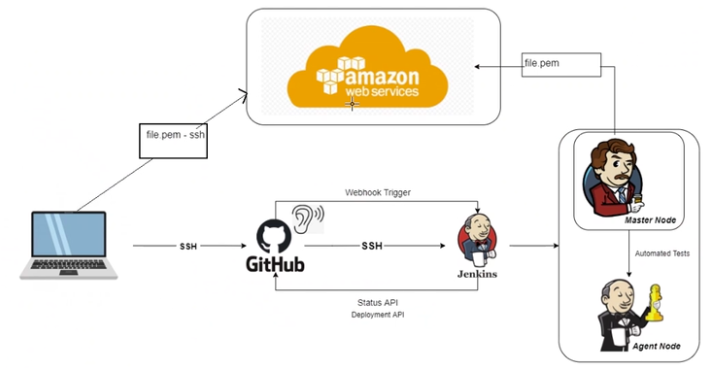
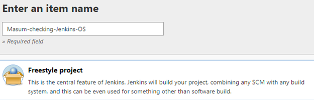
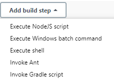

## What is Jenkins?

- Jenkins is an open-source automation server which can be used for CI/CD.
- We have information come in on github, which we can then access through Jenkins.
- Stages refers to different steps in a CI/CD pipeline
- The pipeline is a sequence of stages that define the workflow of software delivery. 

## 1. Checking the code
- We check out code from version control, like Git.
## 2. Build the code
- We compile and build the code into something executable.
## 3. Test
- We test the code using automation to ensure it's working.
## 4. Deploy
- We deploy the code to a staging area.
## 5. Test again
- We test the code again to make sure that the performance and functioality is ok.
## 6. Release
- When all tests have been passed, the product can be released to the customer. 

## What other tools are available?
- GitLab
- CircleCI
- Bamboo
- Docker
- Travis CI

# Working in Jenkins
- We access jenkins through the line `3.9.13.91:8080`
## Create a job
- The jobs in jenkins are the tasks.
- We select `New Item` and then select the option ` Freestyle  project`.

- We then set the max number of builds to `3`
- At the bottom we select `Build` and then `Execute Shell`

- To find the version that we are using, we use the command `uname -a`
- We then apply and save this
- To launch this, we go to `Build now`
- Note: We can edit the input under the `Configure` option. 