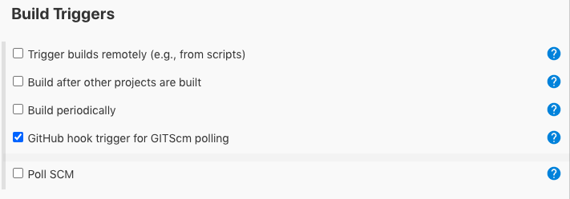
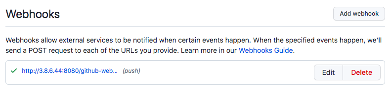

# Webhooks
## What are webhooks?
- They autmatically allow for github to notify Jenkins when a change has been made. This can then this can trigger Jenkins to carry out actions. 
## When is a webhook triggered?
- A HTTP POST request is sent to the webhook endpoint. Jenkins is the reciever, and it acts on the request based on its settings.
## Setting up a webhook
- When creating a Jenkins file, we select:

- In the Github repo we can go to `settings` and then `Add webhooks`.
- We then add the URL in here, `http://"jenkins ip address"/github-webhook/`
- Change the content type to `json`. 
- It should look like this:
